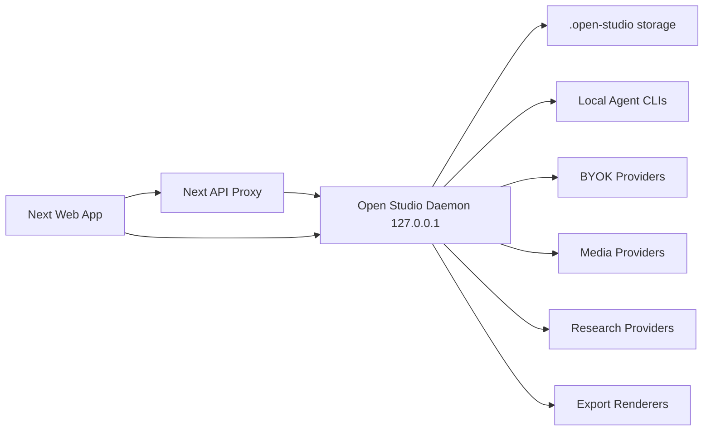

# Open Studio + OpenDesign Complete SDD

Data: 2026-05-11

## 1. Summary

Open Studio sera reconstruido como um workspace local-first de producao de conteudo para criadores, usando a arquitetura do OpenDesign como base de runtime. O produto continua visualmente Open Studio: uma interface escura, premium, cinematica e focada em fluxo de criacao. O que muda por baixo e grande: daemon real, projetos, runs, agentes locais, BYOK, media tool, pesquisa, memoria, criticas, artefatos, export profissional e pacote de conteudo persistente.

O fluxo principal do produto e:

```text
Ideia -> Projeto -> Run -> Pesquisa -> Roteiro -> Titulos -> Thumbnail -> Legendas -> Critica -> Export -> Historico
```

O objeto central deixa de ser uma resposta de endpoint e passa a ser `ContentPackage`, persistido dentro de um `Project`, produzido por um ou mais `Runs`, com arquivos e eventos salvos no artifact store.

## 2. Goals

- Construir um daemon separado em `127.0.0.1`, inspirado no OpenDesign, que concentra runtime privilegiado, storage, agentes, providers, media, pesquisa, exports, logs e runs.
- Preservar a UI visual do Open Studio, removendo mock falso e ligando todas as telas em dados reais.
- Trazer a logica do OpenDesign sempre que fizer sentido para um produto de criacao de video.
- Manter texto e imagem como superficies visiveis principais agora.
- Manter video/audio/musica no daemon e no media contract, escondidos da UI principal ate a fase certa.
- Fazer titulos CTR/SEO e legendas virarem features reais, integradas ao pipeline.
- Transformar titulo + thumbnail em pacote unico de decisao, nao duas geracoes desconectadas.
- Fazer settings parar de ser uma lista confusa e virar centro de execucao: CLI local, BYOK, media providers, research, memoria e modo avancado.
- Garantir testes automatizados e smoke manual dos fluxos principais.

## 3. Non-Goals

- Nao copiar a interface visual do OpenDesign.
- Nao expor video/audio/musica como produto ativo antes de estarem prontos na UI.
- Nao fingir sucesso quando provider falhar.
- Nao esconder erro real de CLI/provider atras de mensagem generica.
- Nao manter surfaces mockadas quando a tela sugere acao real.

## 4. OpenDesign Source Map

| Area | OpenDesign source | Open Studio target |
|---|---|---|
| Daemon/server | `apps/daemon/src/server.ts`, `cli.ts`, `sidecar/*` | `apps/daemon` ou `daemon/`, plus Next proxy |
| Projects/files | `projects.ts`, `project-routes.ts`, `db.ts` | `.open-studio/projects/<projectId>` |
| Runs | `runs.ts`, chat routes, routine runs | `.open-studio/runs.jsonl` + daemon run registry |
| Agent runtimes | `runtimes/*`, stream parsers | `lib/daemon/runtimes/*` or daemon package |
| Media | `media.ts`, `media-routes.ts`, `media-models.ts`, `media-tasks.ts` | `media` service + hidden video/audio |
| Research | `research/*`, `prompts/research-contract.ts` | CTR/SEO/outlier research service |
| Prompt composer | `prompts/system.ts`, `media-contract.ts`, `research-contract.ts`, `directions.ts`, `discovery.ts` | creator prompt composer |
| Skills | `skills.ts`, `skills/*` | `skills registry` for creator workflows |
| Memory | `memory.ts`, `memory-llm.ts`, `memory-extractions.ts` | channel memory and brand voice |
| Critique | `critique/*`, `prompts/panel.ts` | package scoring and review |
| Live artifacts | `live-artifacts/*` | package dashboards/previews |
| Export | `pdf-export.ts`, `transcript-export.ts`, `import-export-routes.ts` | package export bundle |
| Security | `origin-validation.ts`, `redact.ts`, tool tokens | local daemon security |
| Models/tests | `providerModels.ts`, `connectionTest.ts` | provider catalog and diagnostics |

## 5. Product Architecture

### 5.1 Process Topology



Next continua sendo a UI. O daemon vira o runtime privilegiado. Next API routes ficam como compat layer, mas a fonte de verdade passa a ser o daemon.

### 5.2 Daemon Responsibilities

- Iniciar em porta local fixa ou descoberta, preferencialmente `127.0.0.1`.
- Expor health, status, logs e version.
- Ler e gravar `.open-studio/`.
- Gerenciar projetos e runs.
- Detectar CLIs locais.
- Rodar agentes com streaming e cancelamento.
- Normalizar eventos em SSE.
- Proteger base URLs contra SSRF.
- Fazer proxy BYOK.
- Gerenciar media generation.
- Gerenciar research.
- Gerenciar memory, skills e routines.
- Gerar exports profissionais.
- Emitir eventos para UI.

### 5.3 Storage Layout

```text
.open-studio/
  settings.json
  daemon/
    daemon.lock
    daemon.log
    health.json
  projects/
    <projectId>/
      project.json
      package.json
      files/
        briefing.md
        script.md
        titles.json
        thumbnail.prompt.md
        thumbnail.png
        captions.json
        exports/
        research/
        critique/
      artifacts/
        manifest.json
        events.jsonl
      runs/
        <runId>.json
        <runId>.events.jsonl
  assets/
  exports/
  media-tasks/
  skills/
  memory/
  templates/
  logs/
```

### 5.4 Data Model

```ts
type ProjectStatus =
  | "draft"
  | "running"
  | "awaiting_input"
  | "failed"
  | "ready"
  | "exported"
  | "archived";

type RunStatus =
  | "queued"
  | "running"
  | "awaiting_input"
  | "cancelled"
  | "failed"
  | "succeeded";

type RunEventType =
  | "run.start"
  | "agent.start"
  | "agent.delta"
  | "agent.thinking"
  | "agent.tool_call"
  | "agent.file_write"
  | "media.task.created"
  | "media.task.progress"
  | "research.result"
  | "package.updated"
  | "critique.score"
  | "export.created"
  | "run.error"
  | "run.end";

type ContentPackage = {
  id: string;
  projectId: string;
  version: number;
  briefing: BriefingBlock;
  research: ResearchReport[];
  script: ScriptArtifact;
  titlePack: TitlePack;
  thumbnailPack: ThumbnailPack;
  captions: CaptionPack | null;
  critique: CritiqueSummary | null;
  assets: PackageAssetRef[];
  exports: ExportRef[];
  metadata: {
    createdAt: string;
    updatedAt: string;
    sourceRunIds: string[];
    preferredLocale: "pt-BR" | "en" | "es";
    channelId?: string;
    routineId?: string;
  };
};

type TitlePack = {
  topic: string;
  candidates: TitleCandidate[];
  top3: [string, string, string] | [];
  selectedTitleId?: string;
  scoringMethod: "ctr_seo_outlier_v1";
  references: ResearchSourceRef[];
};

type TitleCandidate = {
  id: string;
  title: string;
  score: number;
  ctrScore: number;
  seoScore: number;
  curiosityScore: number;
  clarityScore: number;
  riskScore: number;
  reason: string;
  thumbnailFit: string;
  targetIntent: "search" | "browse" | "hybrid";
};

type ThumbnailPack = {
  prompt: string;
  textOverlay: string;
  imageAssetId?: string;
  provider?: string;
  model?: string;
  titleCandidateId?: string;
  cohesionScore?: number;
};
```

## 6. Public Interfaces

### 6.1 Daemon Core

- `GET /api/health`
- `GET /api/status`
- `GET /api/logs?tail=200`
- `GET /api/version`
- `POST /api/shutdown`

### 6.2 Settings

- `GET /api/settings`
- `PATCH /api/settings`
- `POST /api/settings/validate`

Settings stays browser/localStorage friendly in the web app, but daemon receives per-request credentials for BYOK or stores local config when user explicitly saves machine settings.

### 6.3 Agents

- `GET /api/agents?rescan=1`
- `GET /api/agents/capabilities`
- `POST /api/agents/test`
- `POST /api/agents/run`
- `GET /api/runs/:runId/events`
- `POST /api/runs/:runId/cancel`

Agent events use normalized SSE:

```json
{ "type": "agent.delta", "runId": "run_123", "delta": "texto" }
```

### 6.4 Projects

- `GET /api/projects`
- `POST /api/projects`
- `GET /api/projects/:projectId`
- `PATCH /api/projects/:projectId`
- `DELETE /api/projects/:projectId`
- `GET /api/projects/:projectId/files`
- `GET /api/projects/:projectId/files/:path`
- `PUT /api/projects/:projectId/files/:path`
- `DELETE /api/projects/:projectId/files/:path`
- `POST /api/projects/:projectId/import`
- `GET /api/projects/:projectId/export`

### 6.5 Runs

- `GET /api/runs`
- `POST /api/runs`
- `GET /api/runs/:runId`
- `GET /api/runs/:runId/events`
- `POST /api/runs/:runId/cancel`
- `POST /api/runs/:runId/retry`
- `POST /api/runs/:runId/resume`

### 6.6 Generation

- `POST /api/generate/text`
- `POST /api/generate/image`
- `POST /api/generate/package`
- `POST /api/generate/titles`
- `POST /api/generate/captions`
- `POST /api/generate/thumbnail-package`

All generation endpoints create or attach to a `Project` and a `Run`. Direct endpoint calls remain supported, but they always persist outputs.

### 6.7 Media

- `GET /api/media/config`
- `PATCH /api/media/config`
- `GET /api/media/models?surface=image|video|audio`
- `POST /api/media/generate`
- `GET /api/media/tasks`
- `GET /api/media/tasks/:taskId`
- `POST /api/media/tasks/:taskId/wait`
- `POST /api/media/tasks/:taskId/cancel`

Visible UI defaults to image. Video/audio are hidden but supported by daemon contract.

### 6.8 Research

- `POST /api/research/search`
- `GET /api/projects/:projectId/research`
- `POST /api/projects/:projectId/research/from-topic`

Research is agent-callable and server-callable. Tavily is the first provider. Browser/web fallback can be added only with clear label.

### 6.9 Skills

- `GET /api/skills`
- `POST /api/skills/rescan`
- `GET /api/skills/:skillId`
- `POST /api/skills/install`
- `POST /api/skills/link`

Open Studio skills are creator workflows, not only coding skills.

### 6.10 Memory

- `GET /api/memory`
- `POST /api/memory`
- `PATCH /api/memory/:memoryId`
- `DELETE /api/memory/:memoryId`
- `POST /api/memory/extract`

Memory feeds prompt composer with brand voice, channel positioning, audience, title style, banned words and thumbnail preferences.

### 6.11 Routines

- `GET /api/routines`
- `POST /api/routines`
- `POST /api/routines/:routineId/run`
- `PATCH /api/routines/:routineId`
- `DELETE /api/routines/:routineId`

Default routines:

- `youtube-long-review`
- `youtube-news-hot-take`
- `short-viral`
- `thumbnail-first`
- `script-first`
- `title-outlier-sprint`
- `tool-review-package`

### 6.12 Critique

- `POST /api/critique/package`
- `GET /api/critique/:runId`
- `POST /api/critique/:runId/cancel`

Critique Theater is adapted to score script, title, thumbnail and package cohesion.

### 6.13 Exports

- `GET /api/exports`
- `POST /api/exports`
- `GET /api/exports/:exportId`
- `GET /api/exports/:exportId/download`

Formats:

- Markdown
- JSON
- HTML package page
- PDF
- ZIP
- PPTX/deck, when package has deck sections

## 7. Agent Runtime

### 7.1 Registry

Copy the OpenDesign runtime registry pattern and keep local definitions for:

- Claude Code
- Codex CLI
- Gemini CLI
- OpenCode
- Cursor Agent
- Qwen Code
- GitHub Copilot CLI
- Devin
- Qoder
- Pi
- Kiro
- Kilo
- Kimi
- Hermes
- Mistral Vibe
- DeepSeek TUI
- ACP-compatible agents

Each agent definition must include:

```ts
type RuntimeDefinition = {
  id: string;
  name: string;
  bin: string;
  fallbackBins: string[];
  envKeys: string[];
  installUrl?: string;
  docsUrl?: string;
  defaultModel: string;
  models: RuntimeModel[];
  capabilities: RuntimeCapabilityMap;
  commandBuilder: RuntimeCommandBuilder;
  streamParser: RuntimeStreamParser;
};
```

### 7.2 Capability Gating

Capabilities must drive UI and runtime:

- `streaming`
- `jsonEvents`
- `resume`
- `cancel`
- `fileWrites`
- `shellTools`
- `mediaCommand`
- `nativeImage`
- `nativeSkills`
- `stdinPrompt`
- `filePrompt`
- `maxArgv`
- `workspaceWrite`
- `network`
- `bypassPermissions`
- `surgicalEdit`
- `mcp`

If a flow needs a capability and selected agent lacks it, UI must either:

1. explain the mismatch;
2. offer another detected agent;
3. use BYOK/provider fallback;
4. disable the action with a concrete reason.

### 7.3 Parser Requirements

Implement parser adapters based on OpenDesign:

- Claude stream parser: parse assistant text, thinking, tool use, permission prompts and file writes.
- Codex JSON event parser: extract model errors before stderr noise, handle skills/plugin failures, detect native image events when available.
- Gemini stream-json parser: parse deltas and final response.
- OpenCode parser: plain stream plus tool markers.
- Copilot parser.
- Qoder parser.
- Pi RPC parser.
- ACP parser.
- Plain stream parser fallback.

All parsers normalize to:

```ts
type AgentEvent =
  | { type: "start"; runId: string; agentId: string; model: string }
  | { type: "delta"; text: string }
  | { type: "thinking"; text: string }
  | { type: "tool_call"; name: string; input: unknown }
  | { type: "file_write"; path: string; bytes?: number }
  | { type: "error"; code: string; message: string; raw?: unknown }
  | { type: "end"; usage?: unknown };
```

### 7.4 Prompt Transport

Prompt transport order:

1. stdin when supported;
2. temp prompt file;
3. argv only for tiny prompts and CLIs that require it.

Windows must avoid argv overflow. Large prompts emit `AGENT_PROMPT_TOO_LARGE` before spawning if no safe transport exists.

### 7.5 Power Local Permissions

Use OpenDesign-style defaults:

- Claude: bypass permissions when allowed.
- Codex: workspace write/network profile when possible, disable noisy plugins by default when running inside Open Studio unless user opts in.
- Gemini/OpenCode: dangerous/accept permissions when supported.
- Other CLIs: strongest local mode available with clear status.

These defaults are accepted because Open Studio is a local-first power tool.

## 8. Fallback Chain

Every generation run gets a visible fallback policy:

```text
preferred CLI -> alternate detected CLI -> BYOK text/image provider -> local OpenAI-compatible provider -> fail with actionable error
```

Fallback must be explicit in run events:

```json
{
  "type": "fallback.used",
  "from": "codex",
  "to": "openai",
  "reason": "not_found_model"
}
```

UI must show:

- selected route;
- fallback route used;
- provider/model actually used;
- error from skipped route.

Image fallback is separate from text fallback. A text CLI cannot generate image unless it has native image capability or can call the media tool.

## 9. BYOK And Provider Catalog

### 9.1 Text Providers

- Anthropic
- OpenAI
- OpenAI-compatible
- Azure OpenAI
- Gemini
- OpenRouter
- Groq
- Together
- DeepSeek
- MiniMax
- Ollama
- LM Studio
- vLLM
- Local OpenAI-compatible

### 9.2 Image Providers

- OpenAI image
- Azure OpenAI image
- Volcengine Ark / Doubao Seedream
- Grok Imagine
- Nano Banana / Google
- BFL / FLUX
- fal.ai
- Replicate
- Google Imagen
- MiniMax image
- local/stub for demo mode

### 9.3 Hidden Media Providers

Hidden from active UI until ready, but present in daemon catalog:

- Seedance
- Veo
- Sora via provider/gateway
- Kling
- HyperFrames local renderer
- Suno
- Udio
- ElevenLabs
- FishAudio
- MiniMax TTS/video
- Volcengine TTS/video

### 9.4 Model Discovery

Use a single provider/model registry. It supports:

- hardcoded catalog;
- live model discovery when provider supports it;
- cache per provider;
- model availability status;
- default model by capability;
- hidden/unsupported/integrated labels;
- custom model input for compatible providers.

## 10. Media Contract

Open Studio daemon injects:

- `OS_NODE_BIN`
- `OS_BIN`
- `OS_PROJECT_ID`
- `OS_PROJECT_DIR`
- `OS_DAEMON_URL`

Agents call:

```bash
"$OS_NODE_BIN" "$OS_BIN" media generate \
  --project "$OS_PROJECT_ID" \
  --surface <image|video|audio> \
  --model <model-id> \
  --output <filename> \
  --prompt "<full prompt>"
```

Long-running providers return `taskId`. Agents then call:

```bash
"$OS_NODE_BIN" "$OS_BIN" media wait <taskId> --since <n>
```

Rules:

- Generated bytes are always written by daemon.
- Agents never fabricate image/video/audio bytes.
- For hidden video/audio, daemon can support the command while UI does not advertise the feature.
- Provider errors are surfaced verbatim.
- Stub output is labelled and never presented as real provider success.

## 11. Research And CTR/SEO

CTR/SEO title generator is a first-class feature.

### 11.1 Input

- topic, unlimited length;
- briefing;
- audience;
- existing script;
- thumbnail concept;
- references/outliers;
- language;
- channel memory;
- search intent;
- clickbait tolerance;
- SEO priority;
- risk tolerance.

### 11.2 Research

Research uses:

- Tavily if configured;
- optional BYOK search provider later;
- manually pasted outliers;
- project history;
- channel memory.

Research result writes `files/research/<slug>.md` and structured JSON.

### 11.3 Output

Always generate 10 title candidates and rank top 3.

Each candidate includes:

- title;
- score;
- CTR score;
- SEO score;
- curiosity score;
- clarity score;
- risk score;
- reason;
- search intent;
- thumbnail fit;
- suggested thumbnail text.

Top 3 must be visible in pipeline and content route. Full 10 must persist and be reusable.

## 12. Captions / Legendas

Caption generation exists as registered route now and becomes full feature when Lucas provides the final pattern.

Until the pattern is set:

- UI accepts script and pattern input.
- API refuses to invent a house style if pattern is empty.
- Run persists a blocked state: `awaiting_caption_pattern`.
- User can save the pattern into memory/routine later.

When pattern exists:

- Generate platform-specific captions.
- Persist caption pack.
- Include captions in exports.

## 13. Prompt Composer

Prompt composer replaces isolated endpoint prompts.

Layers:

1. Product identity.
2. Current routine.
3. Project metadata.
4. User request.
5. Brand kit and channel voice.
6. Memory.
7. Research contract.
8. Media contract.
9. Skills.
10. Capability constraints.
11. Output schema.
12. Critique rubric.

Prompt composer must produce inspectable prompts for debugging.

## 14. Skills Registry

Skills are local folders with:

```text
SKILL.md
assets/
references/
scripts/
```

Open Studio uses skills for creator workflows:

- CTR/SEO title strategist.
- YouTube outlier researcher.
- Thumbnail creative director.
- Script doctor.
- Caption formatter.
- Shorts hook generator.
- Tool review package.
- News/package verifier.
- Export formatter.
- Critique panelist.

The registry scans:

- `.open-studio/skills`
- project `.agents/skills`
- user `.codex/skills`
- OpenDesign-imported creator skills

UI exposes skills only where useful: routine settings, prompt composer, run details and advanced settings.

## 15. Brand Kit / Design Systems Adaptation

OpenDesign design systems become Open Studio Brand Kit.

Brand Kit fields:

- channel name;
- audience;
- voice;
- tone boundaries;
- banned words;
- title style;
- thumbnail style;
- color cues;
- typography cues;
- recurring characters/objects;
- examples of good titles;
- examples of bad titles;
- platform rules.

Brand Kit writes `brand-kit.json` and `BRAND.md` per project/channel.

## 16. Memory

Memory stores durable preferences:

- channel voice;
- user writing pattern;
- preferred title shapes;
- recurring audience pain points;
- thumbnail patterns;
- provider preferences;
- failed models;
- caption pattern when Lucas defines it.

Memory is injected only when relevant and visible in run debug.

## 17. Routines

Routines are saved pipeline presets.

Default routines:

- YouTube long video.
- YouTube tool review.
- YouTube news/commentary.
- Short/clip.
- Thumbnail-first.
- Script-first.
- CTR title lab.
- Research-only.

Each routine defines:

- steps;
- default providers;
- default skills;
- required inputs;
- optional research;
- critique threshold;
- export bundle.

## 18. Critique Theater Adaptation

Critique Theater becomes Package Review.

Panel roles:

- CTR editor.
- SEO strategist.
- Thumbnail creative director.
- Audience skeptic.
- Brand guardian.
- Script clarity reviewer.

Outputs:

- title ranking adjustments;
- thumbnail/title cohesion score;
- script risks;
- package risk notes;
- recommended final pick;
- transcript and scoreboard.

This should run after package generation and before export when enabled.

## 19. Live Artifacts

Open Studio live artifacts are editable package previews:

- package summary page;
- title scoreboard;
- thumbnail board;
- research board;
- export preview;
- channel memory dashboard.

Live artifacts have template, data, provenance, refresh status and file output.

## 20. File Workspace

Assets become project files with a workspace:

- file tree;
- viewer;
- editor for markdown/json/text;
- image preview;
- upload/paste;
- manual edit panel;
- search;
- rename/delete with safe paths.

Existing global assets can continue, but project files are preferred.

## 21. Sketch Editor

Sketch editor supports thumbnail/storyboard direction:

- rough layout blocks;
- text overlay position;
- face/object/arrow markers;
- color swatches;
- aspect ratio presets;
- prompt generation from sketch metadata.

This can start as structured JSON + preview, then become canvas later.

## 22. Settings UX

Settings should have clear groups:

- Execution: CLI local and BYOK.
- Providers: text/image/media/research, with active/hidden labels.
- Defaults: default route for text, image, title, package.
- Brand kit and memory.
- Routines.
- Language and appearance, marked as future until implemented.
- Advanced: daemon, storage path, diagnostics, security, logs.

Remove fake tabs that do not work. Advanced hidden capabilities can exist when backend supports them.

Copy rules:

- "Detectado" means binary found.
- "Conectado" means smoke test passed.
- "Nao encontrado" means install or configure path.
- API key enables provider calls; it does not automatically change defaults.
- Defaults choose what generation uses.

## 23. Security

Required:

- origin validation for local daemon;
- token/HMAC for privileged file/import actions;
- SSRF guard for baseUrl;
- redaction for API keys and auth headers;
- safe project path validation;
- no path traversal;
- localhost/private IP policy with local LLM exceptions;
- log redaction;
- bounded upload sizes;
- explicit user action for destructive operations.

## 24. Import/Export

Project import:

- validate archive;
- reject unsafe paths;
- create project;
- import files and package metadata.

Project export:

- full zip;
- package md/json/html/pdf;
- images;
- research reports;
- critique transcript;
- run history summary.

## 25. i18n

First target: pt-BR.

Strings must be centralized before expanding.

Supported planned locales:

- pt-BR
- en
- es

No route should hardcode mixed PT/ES copy after i18n migration.

## 26. Deployment / Tunnel

Local-first is default. Later:

- daemon tunnel;
- remote daemon URL;
- web direct BYOK;
- Vercel deploy for UI only;
- local daemon discovery from browser.

This is lower priority than local complete flow.

## 27. Testing Strategy

### Unit

- project store safe paths;
- run lifecycle;
- event normalization;
- agent parsers;
- capability gating;
- fallback policy;
- media model registry;
- media tasks;
- research parser;
- title scoring parser;
- export bundle writer;
- settings validation;
- SSRF/origin validation.

### API

- agents list/test/run;
- projects CRUD;
- runs start/events/cancel;
- generate text/image/package/titles/captions;
- media generate/wait/cancel;
- research search;
- memory CRUD;
- skills scan;
- exports.

### E2E

- Settings detects local CLIs.
- Settings saves BYOK provider and default.
- Script generation persists to project.
- Title route generates 10 and top 3.
- Pipeline reuses title pack in content route.
- Image generation writes file and asset.
- Package export creates MD/JSON/HTML/PDF/ZIP.
- Fallback route is visible when selected CLI fails.
- Captions refuse empty pattern and generate with pattern.

### Smoke

Run in demo/stub mode:

```powershell
rtk npm test
rtk npm run lint
rtk npm run build
rtk npm run dev
```

Then manually verify:

- `/settings`
- `/scripts`
- `/content`
- `/thumbnails`
- `/pipeline`
- `/assets`
- export download

Run with one real text provider and one real image provider before release.

## 28. Migration Plan

1. Keep existing Next routes as compatibility.
2. Add daemon package and route forwarding.
3. Move services from `lib/daemon` into daemon runtime step by step.
4. Introduce projects/runs and make old endpoints attach to a project.
5. Move assets/exports into project files.
6. Add prompt composer and runtime contracts.
7. Replace simple agent text runner with evented runtime.
8. Add research/title package.
9. Add media contract and hidden video/audio.
10. Add critique/export/live artifacts.
11. Collapse compatibility paths once UI uses new project APIs.

## 29. Acceptance Criteria

The buildout is accepted when:

- app starts with web + daemon;
- `/api/health` and daemon health are green;
- settings detects available CLIs and tests selected agent;
- BYOK provider test is categorized;
- text generation works with CLI and BYOK fallback;
- image generation works with selected image provider or explicit stub/demo mode;
- pipeline produces a persistent project package;
- route `/content` shows the title pack generated in pipeline;
- full 10 titles and top 3 are persisted;
- captions route blocks without pattern and works with pattern;
- thumbnail/title cohesion is scored;
- assets/file workspace shows generated files;
- export bundle downloads with package files and image references;
- run history shows status, errors and fallback;
- unit/API/E2E checks cover the behavior;
- no visible UI claims unsupported music/video as active feature.

