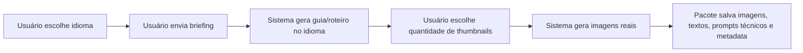

# Open Studio SDD - i18n Global e Thumbnail Batch Real

Data: 2026-05-12

## Summary

Esta fase deixa o Open Studio com idioma real de produto e geração, sem transformar isso em um projeto longo. O escopo ativo é:

- UI principal em `pt-BR`, `es-ES` e `en-US`.
- Novas gerações respeitam o idioma selecionado.
- Espanhol significa sempre espanhol da Espanha.
- Thumbnails deixam de ser tratadas como "prompt final" e passam a ser geração real de imagens em lote.
- Prompts técnicos para imagem continuam em inglês, porque os providers respondem melhor assim.
- Regra rígida: qualquer texto visível na imagem deve estar no idioma selecionado.

Pacotes antigos não são traduzidos nem regenerados quando o idioma muda. O idioma controla somente novas gerações.

## Product Rules

1. `settings.language` é a fonte persistida do idioma do Studio.
2. O switcher de idioma altera a UI e salva a preferência para próximas gerações.
3. Cada nova geração recebe `locale`.
4. Cada novo pacote salva `contentLocale`.
5. `pt-BR` gera português do Brasil.
6. `es-ES` gera espanhol da Espanha, sem LATAM.
7. `en-US` gera inglês.
8. Imagens sempre recebem prompt técnico em inglês.
9. Texto visível de thumbnail sempre deve estar no idioma selecionado.
10. Se o usuário escrever texto de thumbnail em outro idioma, a geração deve adaptar o sentido para o idioma selecionado.
11. O usuário escolhe quantas thumbnails reais quer gerar.
12. Testes automatizados completos rodam somente ao final da última sprint desta fase.

## Architecture

### Locale Core

Criar uma camada compartilhada em `lib/locales.ts`:

- `Locale = "pt-BR" | "es-ES" | "en-US"`.
- `DEFAULT_LOCALE = "pt-BR"`.
- `normalizeLocale(input)` aceita valores legados (`pt`, `es`, `en`) e retorna o novo locale.
- `localeToGenerationLanguage(locale)` retorna o nome de idioma usado nos prompts.
- `buildTextGenerationLocaleInstruction(locale)` injeta regra de idioma para LLMs.
- `buildImageGenerationLocaleInstruction(locale, visibleText?)` injeta regra de thumbnail: prompt técnico em inglês, texto visível no idioma escolhido.

### Settings

`AppSettings.language` passa a usar `Locale`.

Migração aceita:

- `pt` -> `pt-BR`
- `es` -> `es-ES`
- `en` -> `en-US`

O endpoint `/api/settings` continua retornando settings sem API keys, agora com `language` normalizado.

### i18n UI

`lib/i18n.tsx` passa a usar os mesmos locales:

- `pt-BR`
- `es-ES`
- `en-US`

O `LanguageSwitcher` salva no localStorage e sincroniza com `/api/settings`. A UI muda imediatamente; gerações futuras usam o valor salvo.

### Generation Contract

`TextGenerationRequest` e `ImageGenerationRequest` aceitam `locale`.

`generateTextWithProvider` aplica a instrução de idioma no `systemPrompt`, exceto quando o prompt já for explicitamente técnico e local.

`generateImageWithProvider` não traduz o prompt inteiro para o idioma do usuário. Ele preserva o prompt técnico em inglês e reforça:

- all visible text must be in the selected language;
- no random letters;
- no gibberish;
- adapt any supplied visible text into the selected language.

### Thumbnail Batch Real

Adicionar rota de primeira classe:

`POST /api/generate/thumbnails`

Input:

```ts
{
  topic: string;
  title?: string;
  briefing?: string;
  visibleText?: string;
  quantity: number; // 1-10
  locale?: Locale;
  style?: string;
  audience?: string;
  mood?: string;
  background?: string;
  colorPreference?: string;
  referenceImage?: string;
  referenceType?: "face" | "style";
  provider?: { providerId?: string; model?: string };
  projectId?: string;
  saveToAssets?: boolean;
}
```

Output:

```ts
{
  ok: true;
  locale: Locale;
  thumbnails: Array<{
    id: string;
    url: string;
    remoteUrl?: string;
    visibleText: string;
    technicalPrompt: string;
    providerId: string;
    model: string;
    variation: number;
    metadata: {
      topic: string;
      title?: string;
      style?: string;
      ctrAngle?: string;
    };
  }>;
}
```

The product output is the real generated image. The technical prompt is stored for audit/debug only.

## UX Flow

Primary simple flow:



Thumbnail page:

- Field for quantity: `1`, `2`, `3`, `4`, `5`, `8`, `10`.
- Primary button label should make the result clear: `Gerar imagens`.
- Prompt technical details stay collapsed/debug, not the main deliverable.
- The grid shows each generated image and its visible text.
- If provider fails, show real provider error category, not fake success.

## Prompt Rules

### Text Prompt Rule

For all script/title/caption/package generation:

```text
Write all user-facing content in {language}.
If the user brief is in another language, use it only as source material and answer in {language}.
For Spanish, use Spanish from Spain.
Do not mix languages unless the user explicitly provides a brand/product name.
```

### Image Prompt Rule

For image providers:

```text
Write this image-generation prompt in English for best provider performance.
Any visible text, lettering, UI labels, captions, headline words, badges, or typography inside the image must be in {language}.
If visible text is supplied in a different language, adapt its meaning into {language}.
Avoid gibberish text, random letters, fake UI text, fake logos, watermarks, and unreadable typography.
```

## Sprint Plan

Current status:

- Sprint 1 completed on 2026-05-12.
- Quick structural validation completed with `rtk npm run typecheck`.
- Full test suite remains deferred to Sprint 5 by product decision.

### Sprint 1 - Locale Foundation

- Create shared locale module.
- Migrate settings language to `pt-BR | es-ES | en-US`.
- Update i18n provider and switcher.
- Add locale fields to generation schemas/types.
- Add central locale instructions for text and image requests.
- Do not run full test suite in this sprint.

### Sprint 2 - Thumbnail Batch API

- Add `POST /api/generate/thumbnails`.
- Generate 1-10 real images.
- Store each thumbnail as asset.
- Store locale, visible text, prompt, provider/model metadata.
- Reuse existing provider adapters and image cache.

### Sprint 3 - Thumbnail UI Wiring

- Add quantity selector to thumbnail page.
- Rename main action around real image generation.
- Display generated batch with metadata.
- Keep prompt technical detail secondary.
- Ensure selected language controls thumbnail visible text.

### Sprint 4 - Pipeline Integration

- Add thumbnail quantity to pipeline package flow.
- Save batch in `files/thumbnails.json`.
- Include thumbnail images and locale in package export metadata.

### Sprint 5 - Final Verification

Run the full verification only here:

```powershell
rtk npm run lint
rtk npm run typecheck
rtk npm test
rtk npm run build
rtk npm run test:e2e
```

Manual smoke:

- Switch PT -> generate script/title/caption/thumb.
- Switch ES -> generate script/title/caption/thumb; confirm Spanish from Spain.
- Switch EN -> generate script/title/caption/thumb.
- Generate thumbnail quantities `1`, `3`, `10`.
- Confirm provider errors are shown honestly.

## Non-Goals

- No translation/regeneration of old packages.
- No LATAM Spanish mode.
- No new provider implementation in this phase.
- No redesign.
- No full test suite until the final sprint.
